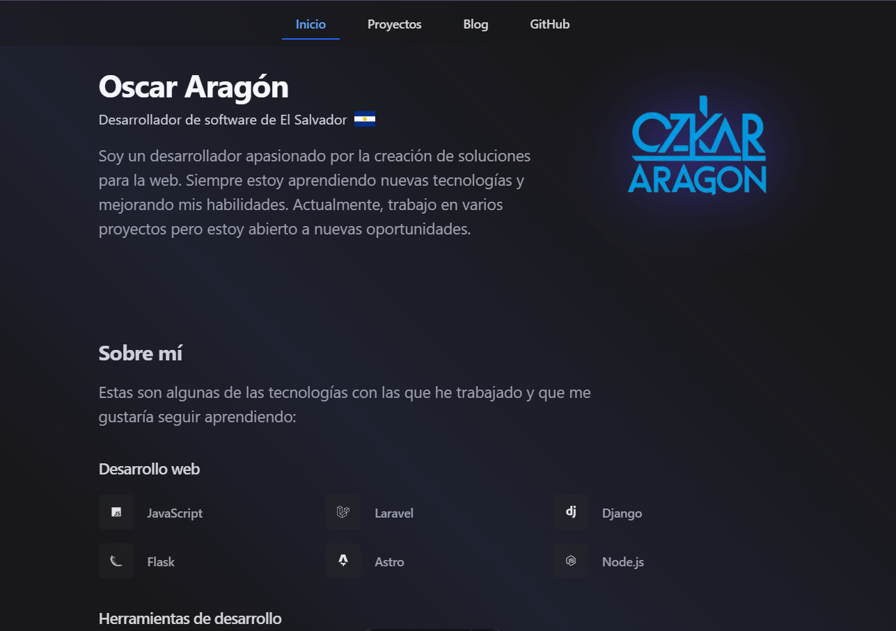

<p style="text-align: left;">

</p>

# ozkkar.dev

```sh
👋 Welcome to my portfolio and blog website!
```

> 🧑‍🚀 **How is this site built?** Powered by Astro and Tailwind CSS. Have fun!

<figure>

</figure>

## 🚀 Project Structure

Inside the project, you'll see the following folders and files:

```text
/
├── public/
│   └── favicon.ico
├── src/
│   ├── assets/
│   │   └── heros/
│   │   └── me.webp
│   ├── components/
│   │   └── Badge.astro
│   │   └── BlogCard.astro
│   │   └── Footer.astro
│   │   └── Header.astro
│   │   └── Link.astro
│   │   └── Pagination.astro
│   │   └── ProjectCard.astro
│   │   └── Skill.astro
│   ├── content/
│   │   └── blog/
│   │   └── config.ts
│   ├── data/
│   │   └── contributions.json
│   │   └── navigation.json
│   │   └── socials.ts
│   │   └── technologies.json
│   ├── layouts/
│   │   └── AppLayout.astro
│   │   └── BlogLayout.astro
│   ├── pages/
│   │   └── blog/
│   │   └── index.astro
│   │   └── projects.astro
│   │   └── 404.astro
│   ├── styles/
│       └── global.css
└── astro.config.mjs
└── tailwind.config.cjs
└── tsconfig.json
└── package.json
```

To learn more about the folder structure of an Astro project, refer to [Astro project structure](https://docs.astro.build/en/basics/project-structure/).

## 🧞 Commands

All commands are run from the root of the project, from a terminal:

| Command                   | Action                                           |
| :------------------------ | :----------------------------------------------- |
| `npm install`             | Installs dependencies                            |
| `npm run dev`             | Starts local dev server at `localhost:4321`      |
| `npm run build`           | Build your production site to `./dist/`          |
| `npm run preview`         | Preview your build locally, before deploying     |
| `npm run astro ...`       | Run CLI commands like `astro add`, `astro check` |
| `npm run astro -- --help` | Get help using the Astro CLI                     |

## 👀 Want to learn more?

Feel free to check [Astro documentation](https://docs.astro.build).
